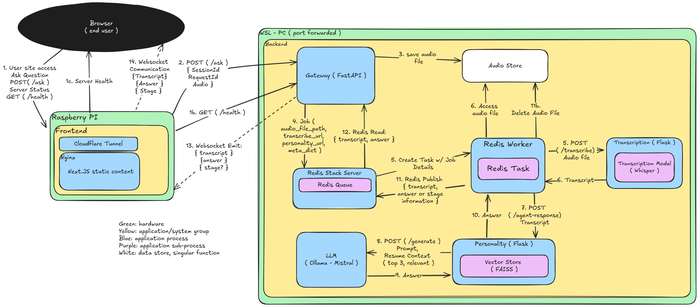

# Resume-Agent

**Resumes are dead PDFs.**  
This project turns mine into a living, interactive conversation—built for recruiters, collaborators, and engineers who want to see a scaled RAG application in action.

---

## Mission 🎯
Static resumes don’t tell the story of engineering depth. The **Resume-Agent** reimagines career presentation as a **conversational AI system**:  
- Recruiters can quickly explore relevant experience.  
- Collaborators can understand past projects without meetings.  
- Engineers can see a **production-grade RAG stack** with modular services.  

---

## Architecture 🏗️

The system is composed of independent services connected by Redis, FastAPI, and WebSockets.

**Key Components:**
- **Frontend (Next.js + TypeScript)**: microphone UI, live waveform, and conversational interface.  
- **Gateway (FastAPI)**: orchestrates audio uploads, WebSocket sessions, and job dispatch.  
- **Transcription Service (Flask)**: Whisper + ffmpeg for audio-to-text.  
- **Personality Service (Flask)**: LLM (Ollama/Mistral) with FAISS vector store for retrieval.  
- **Redis (RQ workers)**: job queue, caching, and **idempotency for prod scale**.  

---

## Tools & Stack 🔧
- **Frontend**: Next.js, TypeScript, TailwindCSS, Nginx, Cloudflare Secure Tunnel
- **Gateway**: FastAPI (Uvicorn/Gunicorn)  
- **Microservices**: Flask apps (transcription, personality)  
- **Vector Store**: FAISS for retrieval  
- **Model Serving**: Ollama (local LLM deployment)  
- **Queueing & State**: Redis + RQ workers  
- **Infra & Dev**: Conda environments, tmux dashboards, Makefile automation  

---

## Usage ⚡
Each service runs independently. Full instructions are in the [`frontend`](./frontend) and [`backend`](./backend) folders.